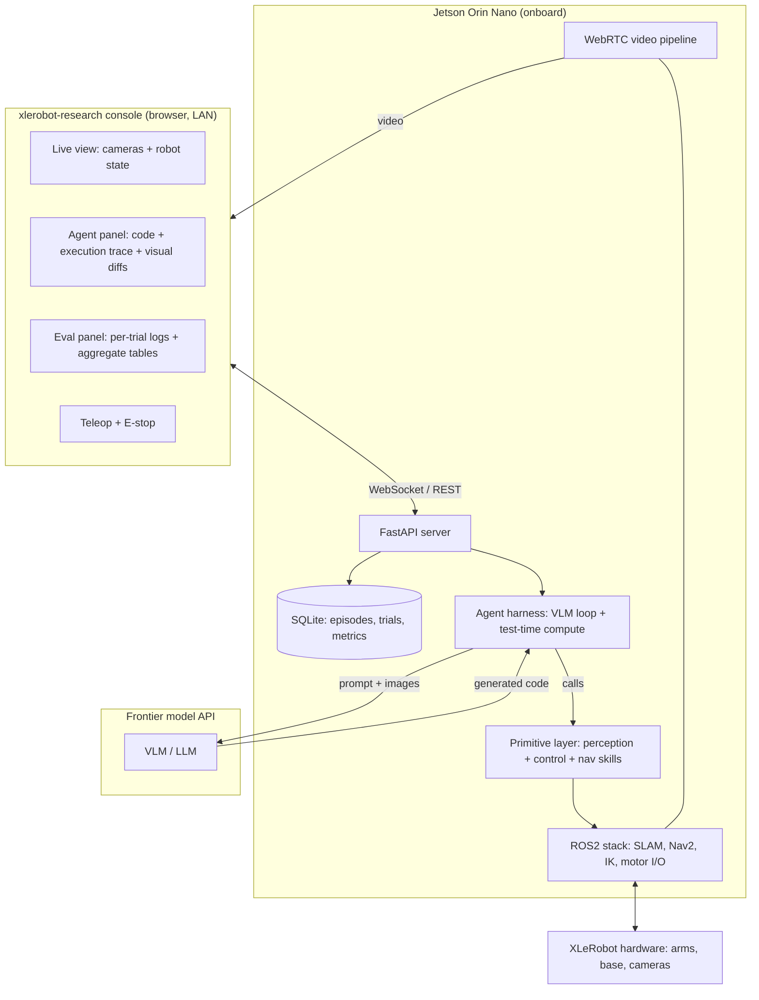
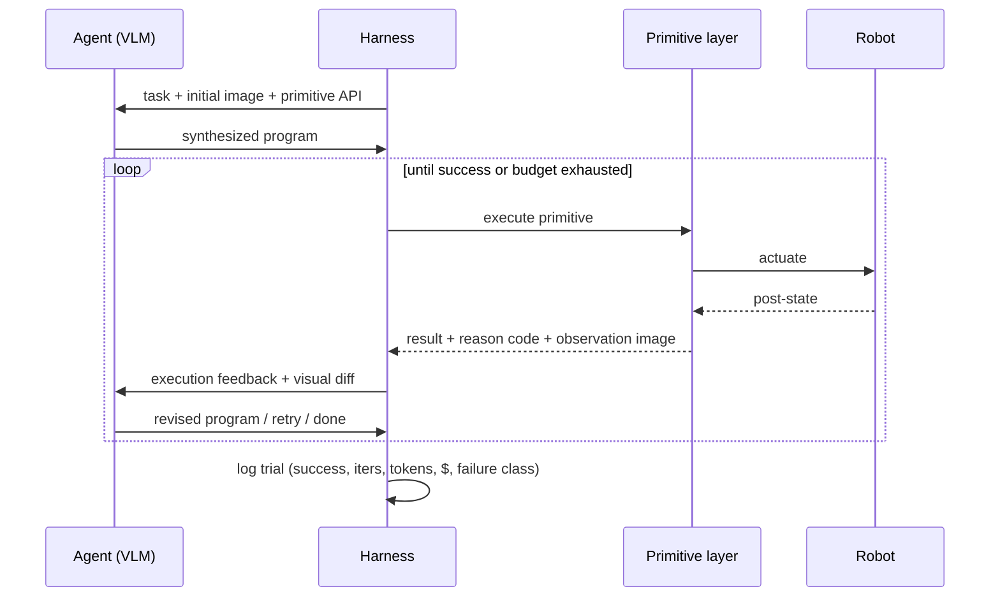

# xlerobot-research — Project Specification

**A senior-thesis research platform and web console for studying embodied coding agents on low-cost hardware.**

Authors: Rane Gray + collaborator (CU Boulder, senior theses, Spring 2026)
Status: Draft v0.1 — pre-semester planning
Platform: XLeRobot (self-built "xlerobot-research" configuration) + Jetson Orin Nano onboard compute

---

## 1. North star

We are testing a single bet:

> **Agentic test-time compute can buy back the reliability that cheap hardware gives away.**

CaP-X / CaP-Agent0 showed that a frontier model, wrapped in a harness that lets it retry, read execution feedback, diff images, and synthesize skills, can hit human-level reliability on manipulation tasks *without training* — but they did this on well-behaved embodiments where the underlying primitives are dependable. Our hardware is the opposite: sub-centimeter servo error, flexy wrists, a differential-drive base that slips. The whole paradigm rests on an assumption our robot violates.

So the project is two intertwined things:

1. **A research question** (Rane's thesis): does the agentic recovery machinery compensate for unreliable actuation, and at what cost — or does error compound faster than the agent can correct?
2. **A web app** (`xlerobot-research`): the observability-and-eval console that *is* the experimental apparatus — live operation, the agent's generated code beside its execution trace and visual diffs, and per-trial success/cost logging that aggregates into the tables the thesis reports.

The app is not a side project competing with the thesis. It is the instrument the thesis is run on. Every feature exists because an experiment needs it.

---

## 2. Research questions and hypotheses

The science spine. Everything downstream (tasks, metrics, app features) traces back to one of these.

**RQ1 — Reliability recovery.** To what extent does a CaP-X-style harness recover task success on a low-precision platform, relative to (a) a single-shot code-as-policy baseline on the same hardware, and (b) the same harness on a high-fidelity reference (sim, or published CaP-X numbers)?

**RQ2 — Mechanism attribution.** Which test-time-compute mechanisms — retry, structured execution feedback, visual differencing, ensembled reasoning — carry the reliability gains on noisy hardware? (Ablation study.)

**RQ3 — Cost–reliability tradeoff.** What does recovered reliability cost in iterations, tokens, dollars, and wall-clock per successful task? This is likely the headline result: a $1k robot + frontier model approaching a $30k robot *for quasi-static tasks* is only interesting if the per-success cost is sane.

**RQ4 — Failure characterization.** Where does the approach break? Partition failures into perception, control/actuation, planning, and *irreversible-physical-state* categories, and map them to task properties.

### Hypotheses (falsifiable, and interesting either way)

- **H1.** Test-time compute substantially closes the gap for tasks whose failures are **observable and recoverable** (missed grasp → visible → retry), but not for tasks with **irreversible** failures (object knocked out of workspace, liquid spilled).
- **H2.** On noisy hardware, **visual differencing + execution feedback** contribute more than ensembling, because the dominant value is *detecting* that an execution silently failed — which cheap hardware makes frequent.
- **H3.** Cost scales **super-linearly** with hardware noise (more retries per success), so dollars-per-success, not raw success rate, is where the low-cost story lives or dies.

A negative result is still a thesis. "Agentic recovery fails on irreversible-failure tasks because cheap actuators cause unrecoverable states X% of the time" is a clean, publishable characterization. The contribution is the *measurement*, not a particular outcome.

---

## 3. Background grounding (brief)

- **CaP-X (Fu et al., 2026)** — agents control robots by synthesizing programs that compose perception and control primitives; CaP-Agent0 is a *training-free* harness; gains come from scaling test-time compute (multi-turn interaction, structured execution feedback, visual differencing, automatic skill synthesis, ensembled reasoning). Benchmarked in sim (LIBERO-PRO, Robosuite, BEHAVIOR) with sim2real transfer.
- **Cutting the Cord (your paper, 2026)** — gave XLeRobot an embedded ROS2 autonomy stack on a Jetson Orin Nano: onboard perception, IK, SLAM, navigation, teleop, plus the tri-bus power topology. This is our substrate; we build *on* it, not beside it.
- **XLeRobot** — dual SO101-class arms (~40 cm reach, 600–1000 g payload), ST3215 servos, differential-drive base, browser MuJoCo+3DGS sim. Cheap, capable for quasi-static visual-policy work, unreliable in exactly the ways that make RQ1 interesting.

**The gap we fill:** CaP-X tested cross-*embodiment*. Nobody has tested cross-*quality* — the same agent harness on hardware that is an order of magnitude less precise. That is the novel axis.

---

## 4. System architecture

Four layers. The clean interface between the **primitive layer** and the **agent harness** is what lets the two theses develop in parallel.



**Layer ownership at a glance:**

- **ROS2 stack** — inherited from Cutting the Cord. Shared, mostly untouched.
- **Primitive layer** — collaborator's territory (perception + nav skills), to a shared contract.
- **Agent harness** — Rane's territory (the loop, the test-time-compute mechanisms, logging).
- **Web app** — split: collaborator owns the live/perception views, Rane owns the agent + eval views. Shared shell.

---

## 5. The two theses and division of labor

The project is deliberately structured so that each person has an independently defensible thesis, joined by one well-specified interface.

**Rane — "Agentic test-time compute on unreliable embodiments."**
Owns the harness, the experimental protocol, the reliability/cost study, and the failure taxonomy. Deliverable: a reliability-vs-cost characterization across the task suite, with the mechanism ablation, comparing single-shot vs. full harness vs. (sim/literature) reference.

**Collaborator — "A characterized perception + navigation primitive library for low-cost mobile manipulation."**
Owns the primitive layer: object detection/pose estimation, grasping, `navigate_to` on the SLAM/Nav2 stack, and — critically — *characterization* of each primitive (success rate, precision, latency on real hardware). Deliverable: a documented, benchmarked primitive library plus the live/perception half of the app.

**The contract between them (Section 7) is agreed in Week 1–2 and then frozen.** After that, Rane develops against a stub/sim implementation of the primitives while the collaborator builds the real ones. This decoupling is the single most important risk mitigation in the project (see Section 11).

---

## 6. The agent harness

A CaP-X-style closed loop. The agent receives the task, the current camera image, and the primitive API; it writes a program; the harness executes it primitive-by-primitive, feeds results back, and lets the agent revise until success or budget exhaustion.



**Implement the mechanisms in priority order** (this ordering doubles as the ablation axis):

1. **Single-shot baseline** — agent writes one program, it runs, success/failure logged. No recovery. This is the control condition; build it first.
2. **Retry with execution feedback** — primitive returns a structured reason code; agent sees it and revises. The cheapest, likely highest-value mechanism on noisy hardware (H2).
3. **Visual differencing** — before/after images handed to the agent so it can detect silent failures (gripper closed on nothing). Directly tests H1/H2.
4. **Ensembled reasoning** — sample multiple programs / vote. Expensive; expected to help least per dollar on this hardware. Build last; it may become a "we tested it and it wasn't worth the cost" finding.

Skill synthesis (the agent writing reusable sub-skills) is **out of scope** for v1 — it's a rabbit hole. Note it as future work.

**Budget controls live in the harness, not bolted on later:** a hard per-trial iteration cap, a per-session dollar cap, image downsampling, and prompt caching. These are research-validity features (they define "budget exhausted" in RQ3) as much as cost features.

---

## 7. The primitive API contract

This is the crux interface — get it right in Week 1–2 and the two theses run in parallel; get it wrong and you're coupled all semester. Every primitive is a typed function that **checks its preconditions, acts, and returns a structured, machine-readable result including a post-state observation** so the harness can do visual differencing and feedback.

Sketch (Python; adapt as you go):

```python
@dataclass
class PrimitiveResult:
    success: bool
    reason: str            # enum: OK | OBJECT_NOT_VISIBLE | OUT_OF_WORKSPACE |
                           # GRASP_FAILED | COLLISION_AVOIDED | TIMEOUT | NAV_FAILED ...
    observation: Frame     # post-execution image(s) + robot state snapshot
    metadata: dict         # timings, joint error, confidence, etc.

def pick(object_id: str) -> PrimitiveResult: ...
def place(target: str | Pose) -> PrimitiveResult: ...
def move_to(pose: Pose) -> PrimitiveResult: ...
def navigate_to(location: str) -> PrimitiveResult: ...
def detect(query: str) -> list[Detection]: ...
def get_observation() -> Frame: ...
```

**Contract guarantees the harness can rely on:**

- A primitive **never silently no-ops**: it either acts and reports, or refuses with a reason.
- A primitive **refuses unsafe/invalid requests** (out-of-workspace target, navigate into a wall) rather than attempting them.
- Every result carries a **fresh post-state observation** — this is what makes visual differencing and feedback possible, so it's mandatory, not optional.
- Reason codes are a **closed enum**, agreed jointly, so the harness can branch on them and the failure taxonomy (RQ4) is well-defined.

A **fiducial/stub implementation** of this contract (AprilTag-based `detect`, scripted `pick`) is built first so Rane is never blocked on perception maturity.

---

## 8. Experimental design

### Task suite

Six tasks graded along the two axes that the hypotheses care about: **failure recoverability** and **precision demand**. The grading *is* the experiment — it lets us say "recovery works on recoverable tasks, not irreversible ones," mapped to specific rows.

| # | Task | Precision | Recoverability | Horizon | Probes |
|---|------|-----------|----------------|---------|--------|
| 1 | Pick cube → bin | Low | High | Short | Baseline; retry value |
| 2 | Stack 2–3 cubes | High | Med | Short | Retry under placement error |
| 3 | Pour / transfer contents | Med | **Low** | Short | Feedback; irreversibility (H1) |
| 4 | Bimanual handover | Med | Med | Med | Sequencing two unreliable arms |
| 5 | Mobile fetch (nav → pick → return) | Med | Med | Med | Base noise; loco-manipulation (the CaP-X differentiator) |
| 6 | "Tidy the table" (clear N objects) | Low–Med | Mixed | **Long** | Error compounding over a long horizon |

Start with Tasks 1–2 on **fiducial-tagged / high-contrast objects** so perception is nearly free and you're studying the agent, not debugging grasping (see Section 11). Add real perception and Tasks 3–6 once the loop is solid.

### Conditions (the columns of every results table)

Single-shot baseline · +retry/feedback · +visual diff · +ensembling (full) · *reference* (sim or published CaP-X). The ablation falls out of the cumulative conditions.

### Metrics (all logged automatically by the app)

- **Success rate** over N trials per (task × condition).
- **Iterations per success** — how much recovery effort each success cost.
- **Tokens / dollars / wall-clock per trial and per success** (RQ3).
- **Failure-class distribution** per (task × condition) (RQ4).

### Trial count and the honest stats caveat

Plan **~15–20 trials per (task × condition)**. With six tasks and ~4 conditions that's ~360–480 final trials, plus several times that in dev/debug runs. At small n you get **suggestive trends, not tight confidence intervals** — and that's appropriate and normal for a senior thesis. Mitigate by (a) choosing effect sizes large enough to be visible at this n, (b) reporting full per-trial logs (the app gives you these for free, so the data is transparent and reproducible), and (c) stating the limitation plainly rather than over-claiming significance.

---

## 9. The web app (`xlerobot-research`)

Served off the Jetson, LAN-only. **Do not rebuild Foxglove/Rerun** — generic topic visualization is solved and you'll lose. The value is the *XLeRobot-specific, agent-aware* workflow.

### Priority tiers

**MVP (must exist to run any experiment):**
- Live view — WebRTC camera feed(s) + robot/joint/base state, battery + thermal from the tri-bus monitor (a genuinely novel little panel nobody else has).
- Manual teleop + **E-stop** (Gamepad API → your existing Xbox/Joycon control path).
- Agent panel — the generated program shown beside its live execution trace.
- Trial logging — start/stop a trial, record success/failure + iterations + tokens + cost to SQLite.

**v1 (the thesis instrument):**
- Visual-diff viewer — before/after frames the agent reasoned over, per step.
- Eval runner — pick a task + condition, run N trials, auto-log each.
- Aggregate tables/plots — success rate, cost, failure-class breakdown across task × condition. (These export straight into the thesis.)

**Stretch (only if ahead):**
- Failure-class tagging UI for fast RQ4 labeling.
- Side-by-side condition comparison view.
- Replay of a past trial with synced video + trace.

**Explicitly cut:** auth/accounts, cloud sync, multi-robot/fleet views, anything SaaS-shaped. It's a lab tool for two people.

### Stack (keep it boring)

- **Backend:** FastAPI on the Jetson, talking to ROS2 via `rclpy` or rosbridge.
- **Video:** `aiortc` or a GStreamer WebRTC pipeline. **Not** MJPEG-over-WebSocket — teleop latency will be miserable. (Latency is otherwise a non-issue since the science is quasi-static.)
- **Frontend:** React + Vite.
- **Storage:** SQLite (episodes, trials, metrics). One file, trivially backed up.

### Adoption freebie

Design the trial/episode logging against **LeRobot's dataset conventions** where it's cheap to do so. It costs little and means the recording layer is useful to anyone with a LeRobot rig — 100× your potential user base, and a clean hook for an upstream contribution.

---

## 10. Timeline (≈15–16 weeks, two people, alongside Rane's internship)

CU Boulder spring runs ~mid-January to early May. Rane's internship is eating capacity *now*, so Phase 0 is deliberately tiny and is the only thing that must happen before the semester.

**Phase 0 — pre-semester (low effort, do not skip).**
Walking skeleton only: one WebRTC camera feed in the browser from the Jetson + one button that start/stops a recording. Get CaP-Gym running in sim and watch an agent solve one task end-to-end. Agree and freeze the primitive contract (Section 7). This de-risks the only genuinely fiddly part (video) and the only genuinely blocking decision (the contract).

**Phase 1 — Weeks 1–3.** Primitive layer v1 on fiducials (collaborator) · single-shot baseline harness (Rane) · app shell with live view + agent panel. First trials on Task 1.

**Phase 2 — Weeks 4–7.** Retry/feedback + visual differencing (Rane) · real perception primitives (collaborator) · eval logging + visual-diff viewer in app. End-to-end on Tasks 1–3.

**Phase 3 — Weeks 8–11.** Full task suite incl. mobile fetch + nav primitives · ensembling · eval runner + aggregate tables. This is the data-heavy stretch.

**Phase 4 — Weeks 12–14.** Run experiments at trial scale. Failure-class labeling. Analysis. (Hold this as buffer-rich; hardware *will* eat days here.)

**Phase 5 — Weeks 15–16.** Thesis writeups + defense prep. App polish. Optional: upstream PR + a short tech note ("Cutting the Cord gave XLeRobot a stack; xlerobot-research gives it a face and a benchmark").

Assume ~30–40% of the plan slips. Phase 4's buffer is real; protect it.

---

## 11. Risks and mitigations

- **Primitive flakiness eats the semester** (the big one). → Fiducials/high-contrast objects first; perception maturity last; Rane develops against the stub so he's never blocked. *Boring objects first, science second, generality last.*
- **Two-thesis coupling.** → The frozen contract + sim/stub fallback. If the collaborator's nav slips, Rane keeps moving.
- **Hardware downtime** (stripped ST3215 gears). → Keep spare servos on hand; the platform is cheap to fix, but a stripped gear still costs days. Budget for it in Phase 4.
- **API cost overrun.** → Cheap model for dev, frontier model only for final runs; aggressive prompt caching; image downsampling; hard per-session spend caps in the harness; apply for any academic/research credits early.
- **Scope creep on the app.** → The MVP line is a hard line. The app serves the thesis; if a feature doesn't unblock an experiment, it waits.
- **"Negative result" anxiety.** → Framed so either outcome is publishable; the characterization *is* the contribution (Section 2).
- **Internship overrun into Phase 0.** → Phase 0 is intentionally a weekend or two. The only non-negotiables are the WebRTC skeleton and a working sim agent.

---

## 12. Budget

Rough, order-of-magnitude. You likely already have hardware access through the lab from the paper — if so, the build line drops out.

- **API (the variable that bites):** agentic vision loops are token-hungry (images dominate; ensembling multiplies it). Plausible range over the semester, including dev/debug runs, is roughly **$200–$1,500** depending on model, image counts, and how disciplined the spend caps are. Measure cost-per-trial in Week 2 and let it shape how many trials the thesis can honestly claim.
- **Hardware (if building one fresh xlerobot-research):** ~$600–1,000 BOM + Jetson Orin Nano (~$250–500) + cameras + IKEA cart ≈ **$1.5–2k all-in**.
- **Consumables:** spare ST3215 servos, fiducial/print materials — a small but real line for Phase 4 downtime.

---

## 13. Success criteria

**App.** A demoable MVP by end of Phase 1 (live view + agent code/trace + per-trial logging) and a working eval runner with aggregate tables by end of Phase 3. If a stranger can watch the agent attempt a task and read the success/cost log without touching a terminal, the app has done its job.

**Rane's thesis.** A reliability-vs-cost characterization across the task suite, with the mechanism ablation and the failure taxonomy, answering RQ1–RQ4 — *whatever the answers are*.

**Collaborator's thesis.** A documented, benchmarked primitive library (per-primitive success rate, precision, latency on real hardware) plus the live/perception half of the app.

---

## 14. Open decisions (settle these first)

1. **Own build vs. lab hardware?** Decides the budget and whether you inherit a known-good rig.
2. **Which frontier VLM** for final runs (and the cheap model for dev)? Decides cost-per-trial and the prompt format.
3. **Reference condition:** run CaP-Gym in sim for an apples-to-apples high-fidelity baseline, or cite published CaP-X numbers? Sim is more rigorous but more work.
4. **Reason-code enum:** the exact closed set — agree it jointly before any primitive is written.
5. **Working name** for the harness/thesis (the platform is `xlerobot-research`; the agent layer could use its own handle).

---

*This is a living document. Revise the task suite and timeline as the first real trials teach you what the hardware actually does — they always surprise you.*
